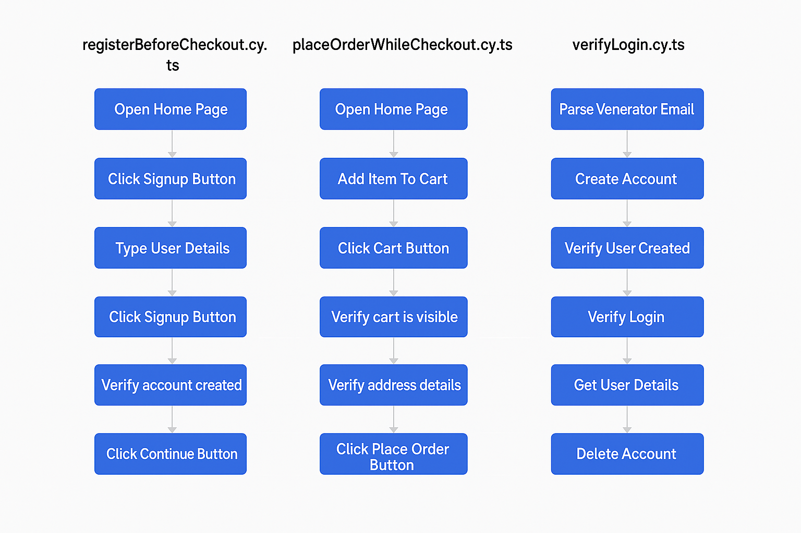

# DOCUMENTATION.md

## Overview

This Cypress test suite covers end-to-end and API testing for the [Automation Exercise](https://automationexercise.com) platform. It includes:

- UI tests using the Page Object Model
- API tests for account creation, login verification, user detail retrieval, and account deletion

---

## Tests Covered

### ✅ `registerBeforeCheckout`
**Purpose:** Verifies user registration from the Cart → Checkout page.

**Steps:**  
1. Adds product to cart  
2. Clicks Cart → Checkout → Register  
3. Completes registration using Page Object flow  
4. Asserts successful registration and account visibility

**Page Objects Used:**  
- `HomePage`  
- `CartPage`  
- `SignupLoginPage`  
- `SignupFormPage`  
- `AccountCreatedPage`  
- `HeaderPage`  

**Why this approach:**  
The Cart → Register path is a realistic user journey often used by first-time shoppers. Page Objects abstract UI details and improve test maintainability.

---

### ✅ `placeOrderWhileCheckout`
**Purpose:** Completes the full order lifecycle: registration, checkout, order placement.

**Steps:**  
1. Adds product to cart  
2. Registers while checking out  
3. Fills in all billing and payment details  
4. Places the order and verifies confirmation

**Page Objects Used:**  
- All used in `registerBeforeCheckout`, plus:  
  - `CheckoutPage`  
  - `PaymentPage`  
  - `OrderConfirmationPage`  

**Why this approach:**  
Test simulates a full buyer journey in one flow to catch edge cases like unfilled billing/payment forms.

---

### ✅ `verifyLogin.cy.ts` (API)
**Purpose:** Validates the following API functionality:  
- Account creation (`POST /api/createAccount`)  
- Login (`POST /api/verifyLogin`)  
- Fetching user details (`POST /api/getUserDetailByEmail`)  
- Account deletion (`DELETE /api/deleteAccount`)

**Why this approach:**  
The APIs are chained to simulate full backend flow and ensure each step supports test isolation and repeatability.

**Challenges & Fixes:**  
- Some responses returned raw strings instead of JSON → `JSON.parse()` was used  
- Missing or misleading documentation for deleteAccount endpoint, though it works correctly

---

## Conclusion

The test suite ensures both frontend and backend systems of AutomationExercise.com are working properly. It uses Cypress best practices (Page Objects, fixtures, isolated assertions) to ensure scalability and maintainability.
